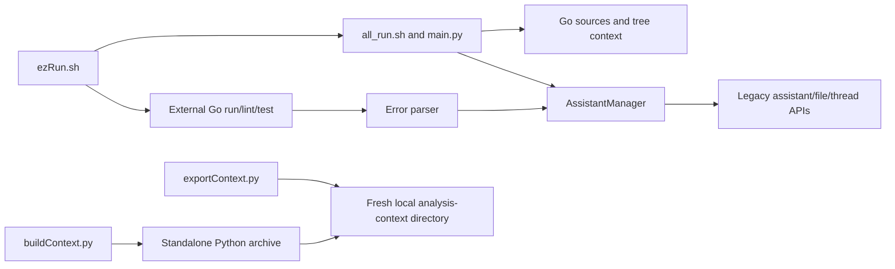

# goPilot

Legacy Python/shell helpers for collecting Go project context, running external Go checks and sending context/errors to an OpenAI assistant. This repository is not a Go application or a web frontend; it has no Go module or application UI.

**Source review is distinct from provider acceptance.** The helper uses legacy SDK/assistant operations and provider-aware operations. No current provider compatibility, configured account or successful provider-backed workflow is established here.

## Real entry points

| Entry | Responsibility |
| --- | --- |
| [ezRun.sh](ezRun.sh) | Flags, helper forwarding, external Go run/lint/test and thread-link postprocessing |
| [all_run.sh](goHelpers/all_run.sh) | Calls the neighboring Python entry with validated arguments |
| [scrapeWeb.sh](goHelpers/scrapeWeb.sh) | Standalone URL-to-context command; calls the adjacent HTML helper and returns its status |
| [exportContext.py](goHelpers/exportContext.py) | Standalone Go analysis-context export into a fresh directory; uses only the Python standard library |
| [buildContext.py](goHelpers/buildContext.py) | Builds a deterministic executable archive of the standalone context exporter |
| [main.py](goHelpers/main.py) | Context assembly and assistant/file lifecycle orchestration |
| [addGo.py](goHelpers/addGo.py) | Provider assistant, files and threads; constructor itself performs remote work |
| [errorParser.py](goHelpers/errorParser.py) / [chatParse.py](goHelpers/chatParse.py) | Error-to-thread workflow and link postprocessing |



[Architecture](docs/architecture.mdx) · [Developer/operation guide](docs/developer/cli.mdx) · [Original README](docs/legacy/README-original.md)

## Configuration and operation boundaries

Provider configuration comes from `OPENAI_API_KEY` in the runtime environment. The provider-aware `main.py` entry rejects a missing/blank value before context generation or manager construction. The separate context export command below needs no provider configuration. No key value belongs in source, documentation or design artifacts. Removal from the current file does not erase Git history or rotate a credential.

The launchers resolve helpers and default `goHelpers/results` outputs relative to this checkout, preserving paths containing spaces. `bash ezRun.sh --help` and `bash goHelpers/all_run.sh --help` exit successfully without running helpers or creating outputs. Unknown/missing/positional arguments and non-boolean flag values and nonexistent/non-directory context targets fail before those operations. The wrapper always launches the provider-aware helper for valid operational arguments; all boolean flags set to false do **not** make a dry run. `-d` selects context while Go commands retain the caller's current directory; the code runner still expects that project's `localtest/run/run.go`.

`-a true` reaches provider-account file enumeration/deletion, broader than local thread-text cleanup. It requires explicit authorization for that account and exact scope. Normal manager construction and upload can also create/update/delete provider objects; do not execute these for a configuration or documentation audit.

`-x true/false` controls thread-text cleanup and defaults true. Cleanup and external checks happen only after successful helper execution; a helper failure is returned unchanged. Go check failures still reach error parsing, and parser failures return a nonzero status. The error parser reads the selected report first, then supplies its own helper directory to the manager. These launcher fixes establish no current provider/SDK compatibility.

## Standalone Go context export

From the repository root, export analysis context using the Python standard library:

```bash
python3 -B goHelpers/exportContext.py SOURCE NEW_OUTPUT_DIR
```

Quote paths containing spaces, for example `python3 -B goHelpers/exportContext.py '/path/Go project' '/path/exports/fresh context'`. The source and output parent must be existing directories. The output must be a new directory outside the resolved source tree: existing files, directories and symlinks, including dangling links, are rejected. Resolving parent symlinks also prevents choosing an output inside the source through another path. The command creates its destination exclusively with mode 0700 on POSIX and writes no generated files into the source.

The export contains UTF-8 `<package>_go.txt` analysis files, `package_map_context.txt`, `directory_tree.txt`, `directory_tree_updated.txt` and `projectDirectoryTree_context.txt`. The tree header lists the packages actually discovered. Tree entries follow the source hierarchy with deterministic directories-first, then files ordering and branch markers that show ancestor continuation and each last sibling. Directory symlinks are explicitly labeled as leaf entries and are not followed. Display labels escape backslashes and control characters while preserving readable Unicode and spaces.

The package map provides authoritative root-relative source paths and generated package filenames. The suffix-updated tree retains the same hierarchy with terminal `.go` file suffixes displayed as `_go.txt`; it does not imply a separate generated output for every source file. Escaped tree labels do not change source identity in the map. Analysis text is not guaranteed to compile, and the tree is not an atomic snapshot of changing source.

The command needs no provider key, dependency installation or Go executable, and performs no provider operations. `--help` returns 0 without creating output. A complete export returns 0 and prints only its destination path to stdout. Invalid arguments, read/walk failures, publication or later output-write failures, and no eligible packages return 1 with a bounded single-line error on stderr. A failure after creating the fresh directory retains and reports that incomplete directory; it does not replace an older export. Exporting does not provide an atomic snapshot of a changing source tree, preserve source metadata, guarantee crash durability or establish Windows permission behavior.

This is a separate entry from the provider-aware launchers. Their key requirement and existing provider workflow remain unchanged. The [export tests](tests/test_export_context.py) exercise the standard-library CLI in isolated temporary projects, deterministic multi-package Unicode output, source and prior-artifact preservation, destination rejection and read/publication failures. Injected walk/later-write failures and a simulated case-folding collision check cover additional failure paths. These tests establish no provider acceptance or native Windows permission behavior.

## Standalone executable and local installation

Build a single-file executable from this checkout using only the Python standard library:

```bash
python3 -B goHelpers/buildContext.py NEW_OUTPUT_FILE
```

Choose a fresh output outside the resolved checkout, with an existing parent directory. Every existing destination entry, including a dangling symlink, is rejected. The builder embeds exactly three unchanged helper modules (`exportContext.py`, `getter.py`, `directoryTree.py`), `__main__.py` as its bootstrap and `manifest.json` as its source-hash manifest. Fixed archive ordering, timestamps, modes and uncompressed entries make identical source bytes produce identical archives. The manifest records source-byte identity; it is not a signature or proof of publisher authenticity.

The archive starts with `#!/usr/bin/env -S python3 -I -B -S`. Its initial target is Linux with CPython 3.10 and GNU `env` supporting `-S`; it still needs a compatible Python interpreter on PATH. It runs without the source checkout, a virtual environment, installed dependencies, provider keys or Go tools. [Python's zipapp documentation](https://docs.python.org/3.10/library/zipapp.html) describes this single-file Python distribution model.

The builder fully writes and closes a private sibling staging file with POSIX mode 0700, publishes through an exclusive hard link without replacing the destination, then removes its owned staging entry. Success returns 0 and prints only the executable path. Build failures return 1 with a bounded one-line error; if publication or staging cleanup has already occurred, diagnostics distinguish the published artifact and any retained staging file. Source files and prior artifacts are not replaced. This publication contract does not guarantee crash durability or platform-independent hard-link behavior.

For a candidate user-local installation, after source/artifact qualification, choose a new owned command name in an existing external directory:

```bash
python3 -B goHelpers/buildContext.py "$HOME/.local/bin/gopilot-context"
"$HOME/.local/bin/gopilot-context" --help
"$HOME/.local/bin/gopilot-context" SOURCE NEW_OUTPUT_DIR
```

An existing command is never overwritten by this builder. Verify the installed archive's hash and executable behavior against the qualified artifact before recording deployment. Any rollback must remove only the owned artifact after confirming its exact bytes. These commands describe the installation workflow; they do not establish that local deployment or executable readback has occurred. The archive preserves the standalone export's fresh-directory, output and failure contracts above; provider migration remains separate.

## Offline verification

Run these checks from the repository root. Shell syntax validation does not execute the wrappers, and the Python suite uses synthetic inputs without contacting a provider:

```bash
bash -n ezRun.sh goHelpers/all_run.sh
python3 -B -m unittest discover -s tests -v
```

The suite combines selected AST checks for runtime configuration/startup ordering with actual offline helper execution: [getter tests](tests/test_getter.py) import the context consolidator and [thread-parser tests](tests/test_chat_parse.py) import the link parser, using temporary files to check outputs and input preservation. [Launcher tests](tests/test_launchers.py) execute copied actual scripts with inert Python/Go/lint command adapters; [error-parser tests](tests/test_error_parser.py) execute its actual entry using a fake manager module. These check routing, help/validation, failure ordering and helper/report separation. The suite does not import provider-aware `main.py`, initialize an actual assistant client, run real Go checks or qualify SDK/file-upload integration. Make target execution is explicitly skipped if Make is unavailable; it requires separate qualification in an environment with Make.

In the shared native WSL workspace, coordinate with the existing verification owner and inspect jobs in sibling worktrees before running the suite. Use the shared gate instead of the direct Python command above:

```bash
/home/jkail/.local/bin/agent-heavy-check -- python3 -B -m unittest discover -s tests -v
```

Run the gate in the foreground. Admission exit 75 means the suite did not run; report the contention instead of repeatedly queueing an unchanged check or bypassing the gate. See the [operation guide](docs/developer/cli.mdx) for verification boundaries. The legacy helper Makefile's `install` target installs unpinned provider and other Python dependencies into its selected environment. Use the separate HTML environment below for standalone fetching. `all_run.sh` is maintained source: `create_script` checks its presence and `clean` preserves it; neither regenerates nor deletes the tracked wrapper.

## Standalone HTML environment

The HTML helper needs Requests and Beautiful Soup, independently of OpenAI, provider keys and Go tools. [requirements-html.in](requirements-html.in) records the direct pins; [requirements-html.txt](requirements-html.txt) records the complete dependency set with exact versions and SHA-256 hashes. Install the `.txt` file into an isolated `.venv-html`, rather than running the legacy Make install target. The initial qualification target is Linux with CPython 3.10; other environments require separate qualification.

From the repository root, use a Python installation with `venv` and `ensurepip` available:

```bash
python3 -m venv .venv-html
.venv-html/bin/python -m pip install --require-hashes --only-binary=:all: -r requirements-html.txt
.venv-html/bin/python -m pip check
PATH="$PWD/.venv-html/bin:$PATH" bash goHelpers/scrapeWeb.sh 'https://example.org/docs'
```

On GamingRig, the native Python 3.10 lacks the `ensurepip` prerequisite. The installed uv 0.12.10 supports this alternative environment bootstrap; use it instead of the first command, then run the same explicit pip and fetch commands:

```bash
uv venv --python /usr/bin/python3 --no-python-downloads --seed --no-config .venv-html
```

The uv bootstrap can download installer seed packages; their versions are separate from the application dependency pins. [Python venv](https://docs.python.org/3/library/venv.html) and [uv venv](https://docs.astral.sh/uv/reference/cli/#uv-venv) document these environment operations. In the shared WSL workspace, installations and runtime qualification use the existing owner and foreground heavy-check gate.

The quoted PATH selects the environment's `python3` for the shell command, including checkout paths containing spaces. To select the interpreter directly, use `.venv-html/bin/python goHelpers/htmlParser.py 'https://example.org/docs' "$PWD/goHelpers"`. Both commands save context under the chosen helper's `additionalcontext` directory. Recreate the environment at its destination when moving a checkout.

Regenerate the lock with uv 0.12.10 for the same Linux CPython 3.10 target. Run from the repository root with that interpreter available:

```bash
uv pip compile requirements-html.in \
  --python /usr/bin/python3 --python-version 3.10 \
  --python-platform x86_64-unknown-linux-gnu --generate-hashes \
  --only-binary :all: --output-file requirements-html.txt \
  --default-index https://pypi.org/simple --keyring-provider disabled \
  --no-config --no-python-downloads
```

In the shared WSL workspace, dependency resolution also uses the foreground heavy-check gate. Review and commit the complete generated `.txt` file. Installing that committed lock reproduces application versions; resolving after changing the input or tool can select different versions and requires fresh installation and runtime qualification. Keep provider packages outside this standalone dependency set.

Local GamingRig qualification on 2026-10-03 used CPython 3.10.12 and uv 0.12.10. Two fresh environments installed identical application versions from the hash lock, passed `pip check`, and rejected an intentionally corrupted package hash. The bootstrap seed packages were pip 26.2.1, setuptools 84.0.0, wheel 0.48.0 and packaging 26.3. All 69 offline tests passed without skips. Seven real loopback cases covered a full document, repeated URL, body-less fragment, HTTP 404, refused connection, stalled headers and a stalled partial body; failed fetches preserved existing context, and owned server/temporary fixtures were cleaned up. This qualifies the documented Linux environment and local HTTP behavior; it does not qualify provider APIs, external websites or other platforms. A refused connection checks failure routing, not a measured connection-timeout deadline.

The repository has no license file identified in this snapshot. Existing source and the original README remain the attribution/provenance reference; this documentation adds no license grant.

[Documentation canvas](https://superdesign.dev/teams/daa6c1df-346f-4dc3-81dd-fb4f462aff90/projects/8ddc6d31-cab0-4a6a-b18e-706f0bf43ef2) · [Linear project](https://linear.app/jckail/project/gopilot-25d280e3a6b1)

HTML web contexts use `web-<ASCII host/path slug up to 80 characters>-<full SHA-256 of the exact URL>_context.txt`. The public HTML helper accepts URLs independently of the fixed eight web resources in `main.py`. Host, scheme, port, query, fragment and percent-encoding spelling contribute to exact URL identity; repeated identical URLs reuse the same filename. The readable slug is only a label. Names stay bounded and contained in the helper's `additionalcontext` directory; request URLs and HTML processing remain unchanged.

Existing legacy context files are retained alongside new names. The assistant helper selects every `*_context.txt` file, so old and new contexts may both be loaded. This change performs no migration or cleanup; review stale files separately before any removal. HTML tests execute the actual helper with inert HTTP and HTML dependency adapters, checking distinct URL outputs, repeated URLs, long/Unicode paths, output containment and legacy-file preservation. They do not qualify live HTTP or BeautifulSoup compatibility.

The standalone HTML command returns status 0 and prints its destination to stdout only after saving a complete context. Fetch, parsing and output failures return status 1 with a single-line diagnostic on stderr; argument errors also return 1. Direct `fetchWebData` callers receive `False` for fetch failures and `True` after saving; processing or filesystem exceptions still propagate to direct callers. The provider-aware multi-URL orchestration has its own error policy.

HTML fetching passes explicit positive timeout values to Requests: 5 seconds for connection establishment and 15 seconds of read inactivity. These limits apply to connections and waits between socket reads; they are not an overall request deadline. DNS resolution, redirects, multiple connection attempts and a response that keeps sending bytes can extend total elapsed time. Timeout failures follow the fetch failure behavior above and preserve existing context files. Focused adapter tests cover the timeout arguments and connection, header-read and body-read failures through the direct helper and Python command. These tests do not qualify live networking or real Requests timeout behavior.

Context output is written as UTF-8 to a private temporary file in the destination directory, closed, then atomically replaced. Failed writes, closes or replacements preserve the previous destination bytes and clean up the owned staging file. Successful output uses private file permissions (0600 on POSIX). Replacement changes the file inode and replaces a destination symlink itself without writing through to its target; existing modes and hard-link sharing are not preserved. This provides atomic file visibility, not power-loss durability. Offline tests cover synthetic failures and actual temporary-file writes; they do not qualify live networking or provider integration.

After installing the standalone HTML environment above, use `PATH="$PWD/.venv-html/bin:$PATH" bash goHelpers/scrapeWeb.sh 'https://example.org/docs'` from this checkout to fetch one URL without invoking the provider-aware manager. The shell command locates the adjacent `htmlParser.py`, forwards the exact quoted URL and helper directory, preserves the caller's working directory and returns the helper's exit status unchanged. It preserves stdout/stderr instead of adding a success fallback. Missing, extra or blank arguments return 1 with usage on stderr; `-h` and `--help` return 0 with usage on stdout before dispatch. Invoke the script in its checkout directory layout; an external symlink must also have the helper beside it. Copied-script tests use inert Python adapters and do not qualify live fetch dependencies or networking.

Body-less HTML fragments are accepted: when no body element exists, formatting uses the parsed fragment tree. Existing body-document index/navigation removal and function formatting are preserved. The fragment regression runs the actual helper entry with an inert HTML adapter. Real HTTP/BeautifulSoup qualification requires a separate local fixture run; the adapter test does not establish external network or provider compatibility.
