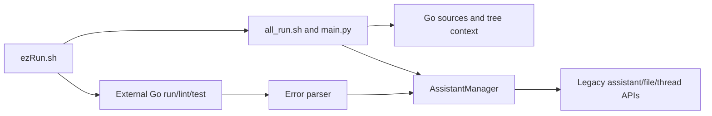

# goPilot

Legacy Python/shell helpers for collecting Go project context, running external Go checks and sending context/errors to an OpenAI assistant. This repository is not a Go application or a web frontend; it has no Go module or application UI.

**Source review is distinct from provider acceptance.** The helper uses legacy SDK/assistant operations and historical paths. No current provider compatibility, configured account, native execution or successful upload is established here.

## Real entry points

| Entry | Responsibility |
| --- | --- |
| [ezRun.sh](ezRun.sh) | Flags, helper forwarding, external Go run/lint/test and thread-link postprocessing |
| [all_run.sh](goHelpers/all_run.sh) | Calls the Python entry using historical helper paths |
| [main.py](goHelpers/main.py) | Context assembly and assistant/file lifecycle orchestration |
| [addGo.py](goHelpers/addGo.py) | Provider assistant, files and threads; constructor itself performs remote work |
| [errorParser.py](goHelpers/errorParser.py) / [chatParse.py](goHelpers/chatParse.py) | Error-to-thread workflow and link postprocessing |



[Architecture](docs/architecture.mdx) · [Developer/operation guide](docs/developer/cli.mdx) · [Original README](docs/legacy/README-original.md)

## Configuration and operation boundaries

Provider configuration comes from `OPENAI_API_KEY` in the runtime environment. The Python entry rejects a missing/blank value before context generation or manager construction. No key value belongs in source, documentation or design artifacts. Removal from the current file does not erase Git history or rotate a credential.

Inspect and correct the selected helper/output paths and target project before operating. The wrapper always launches the helper; all boolean flags set to false do **not** make a dry run. `-d` is forwarded for context selection, while Go commands run from the shell's current directory. Historical paths still point to a `goHelper` tree and the code runner expects a caller's `localtest/run/run.go`.

`-a true` reaches provider-account file enumeration/deletion, broader than local thread-text cleanup. It requires explicit authorization for that account and exact scope. Normal manager construction and upload can also create/update/delete provider objects; do not execute these for a configuration or documentation audit.

The source advertises `-x`, but its `getopts` string omits it. Thread-text cleanup defaults true. No claim is made that the legacy flag/SDK workflow is fixed beyond the runtime-key guard.

## Inert verification

These checks do not import helper modules or contact a provider:

```bash
bash -n ezRun.sh goHelpers/all_run.sh
python3 -B -m unittest discover -s tests -v
```

The tests extract selected AST to verify runtime configuration and startup ordering. They are not an integration test of SDK, file upload or external Go tooling. Python dependencies are not pinned; the helper Makefile installs packages and generates/deletes wrapper files, so its targets are not inert validation.

The repository has no license file identified in this snapshot. Existing source and the original README remain the attribution/provenance reference; this documentation adds no license grant.

[Documentation canvas](https://superdesign.dev/teams/daa6c1df-346f-4dc3-81dd-fb4f462aff90/projects/8ddc6d31-cab0-4a6a-b18e-706f0bf43ef2) · [Linear project](https://linear.app/jckail/project/gopilot-25d280e3a6b1)
