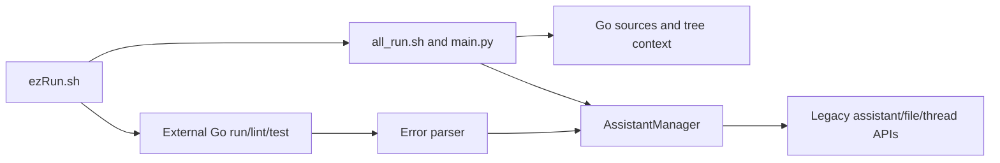

# goPilot

Legacy Python/shell helpers for collecting Go project context, running external Go checks and sending context/errors to an OpenAI assistant. This repository is not a Go application or a web frontend; it has no Go module or application UI.

**Source review is distinct from provider acceptance.** The helper uses legacy SDK/assistant operations and provider-aware operations. No current provider compatibility, configured account or successful provider-backed workflow is established here.

## Real entry points

| Entry | Responsibility |
| --- | --- |
| [ezRun.sh](ezRun.sh) | Flags, helper forwarding, external Go run/lint/test and thread-link postprocessing |
| [all_run.sh](goHelpers/all_run.sh) | Calls the neighboring Python entry with validated arguments |
| [scrapeWeb.sh](goHelpers/scrapeWeb.sh) | Standalone URL-to-context command; calls the adjacent HTML helper and returns its status |
| [main.py](goHelpers/main.py) | Context assembly and assistant/file lifecycle orchestration |
| [addGo.py](goHelpers/addGo.py) | Provider assistant, files and threads; constructor itself performs remote work |
| [errorParser.py](goHelpers/errorParser.py) / [chatParse.py](goHelpers/chatParse.py) | Error-to-thread workflow and link postprocessing |



[Architecture](docs/architecture.mdx) · [Developer/operation guide](docs/developer/cli.mdx) · [Original README](docs/legacy/README-original.md)

## Configuration and operation boundaries

Provider configuration comes from `OPENAI_API_KEY` in the runtime environment. The Python entry rejects a missing/blank value before context generation or manager construction. No key value belongs in source, documentation or design artifacts. Removal from the current file does not erase Git history or rotate a credential.

The launchers resolve helpers and default `goHelpers/results` outputs relative to this checkout, preserving paths containing spaces. `bash ezRun.sh --help` and `bash goHelpers/all_run.sh --help` exit successfully without running helpers or creating outputs. Unknown/missing/positional arguments and non-boolean flag values and nonexistent/non-directory context targets fail before those operations. The wrapper always launches the provider-aware helper for valid operational arguments; all boolean flags set to false do **not** make a dry run. `-d` selects context while Go commands retain the caller's current directory; the code runner still expects that project's `localtest/run/run.go`.

`-a true` reaches provider-account file enumeration/deletion, broader than local thread-text cleanup. It requires explicit authorization for that account and exact scope. Normal manager construction and upload can also create/update/delete provider objects; do not execute these for a configuration or documentation audit.

`-x true/false` controls thread-text cleanup and defaults true. Cleanup and external checks happen only after successful helper execution; a helper failure is returned unchanged. Go check failures still reach error parsing, and parser failures return a nonzero status. The error parser reads the selected report first, then supplies its own helper directory to the manager. These launcher fixes establish no current provider/SDK compatibility.

## Offline verification

Run these checks from the repository root. Shell syntax validation does not execute the wrappers, and the Python suite uses synthetic inputs without contacting a provider:

```bash
bash -n ezRun.sh goHelpers/all_run.sh
python3 -B -m unittest discover -s tests -v
```

The suite combines selected AST checks for runtime configuration/startup ordering with actual offline helper execution: [getter tests](tests/test_getter.py) import the context consolidator and [thread-parser tests](tests/test_chat_parse.py) import the link parser, using temporary files to check outputs and input preservation. [Launcher tests](tests/test_launchers.py) execute copied actual scripts with inert Python/Go/lint command adapters; [error-parser tests](tests/test_error_parser.py) execute its actual entry using a fake manager module. These check routing, help/validation, failure ordering and helper/report separation. The suite does not import provider-aware `main.py`, initialize an actual assistant client, run real Go checks or qualify SDK/file-upload integration. Make target execution is explicitly skipped if Make is unavailable; it requires separate qualification in an environment with Make.

In the shared native WSL workspace, coordinate with the existing verification owner and inspect jobs in sibling worktrees before running the suite. Use the shared gate instead of the direct Python command above:

```bash
/home/jkail/.local/bin/agent-heavy-check -- python3 -B -m unittest discover -s tests -v
```

Run the gate in the foreground. Admission exit 75 means the suite did not run; report the contention instead of repeatedly queueing an unchanged check or bypassing the gate. See the [operation guide](docs/developer/cli.mdx) for verification boundaries. Python dependencies are not pinned; the helper Makefile's `install` target changes the environment. `all_run.sh` is maintained source: `create_script` checks its presence and `clean` preserves it; neither regenerates nor deletes the tracked wrapper.

The repository has no license file identified in this snapshot. Existing source and the original README remain the attribution/provenance reference; this documentation adds no license grant.

[Documentation canvas](https://superdesign.dev/teams/daa6c1df-346f-4dc3-81dd-fb4f462aff90/projects/8ddc6d31-cab0-4a6a-b18e-706f0bf43ef2) · [Linear project](https://linear.app/jckail/project/gopilot-25d280e3a6b1)

HTML web contexts use `web-<ASCII host/path slug up to 80 characters>-<full SHA-256 of the exact URL>_context.txt`. The public HTML helper accepts URLs independently of the fixed eight web resources in `main.py`. Host, scheme, port, query, fragment and percent-encoding spelling contribute to exact URL identity; repeated identical URLs reuse the same filename. The readable slug is only a label. Names stay bounded and contained in the helper's `additionalcontext` directory; request URLs and HTML processing remain unchanged.

Existing legacy context files are retained alongside new names. The assistant helper selects every `*_context.txt` file, so old and new contexts may both be loaded. This change performs no migration or cleanup; review stale files separately before any removal. HTML tests execute the actual helper with inert HTTP and HTML dependency adapters, checking distinct URL outputs, repeated URLs, long/Unicode paths, output containment and legacy-file preservation. They do not qualify live HTTP or BeautifulSoup compatibility.

The standalone HTML command returns status 0 and prints its destination to stdout only after saving a complete context. Fetch, parsing and output failures return status 1 with a single-line diagnostic on stderr; argument errors also return 1. Direct `fetchWebData` callers receive `False` for fetch failures and `True` after saving; processing or filesystem exceptions still propagate to direct callers. The provider-aware multi-URL orchestration has its own error policy.

Context output is written as UTF-8 to a private temporary file in the destination directory, closed, then atomically replaced. Failed writes, closes or replacements preserve the previous destination bytes and clean up the owned staging file. Successful output uses private file permissions (0600 on POSIX). Replacement changes the file inode and replaces a destination symlink itself without writing through to its target; existing modes and hard-link sharing are not preserved. This provides atomic file visibility, not power-loss durability. Offline tests cover synthetic failures and actual temporary-file writes; they do not qualify live networking or provider integration.

From this checkout, use `bash goHelpers/scrapeWeb.sh 'https://example.org/docs'` to fetch one URL without invoking the provider-aware manager. The shell command locates the adjacent `htmlParser.py`, forwards the exact quoted URL and helper directory, preserves the caller's working directory and returns the helper's exit status unchanged. It preserves stdout/stderr instead of adding a success fallback. Missing, extra or blank arguments return 1 with usage on stderr; `-h` and `--help` return 0 with usage on stdout before dispatch. Invoke the script in its checkout directory layout; an external symlink must also have the helper beside it. Copied-script tests use inert Python adapters and do not qualify live fetch dependencies or networking.
