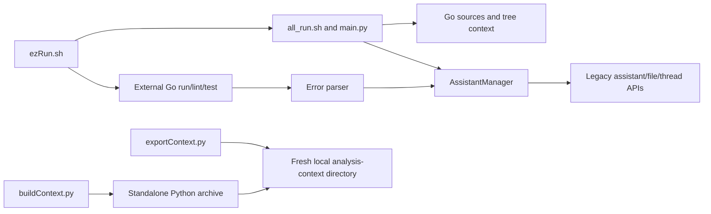

# goPilot

Legacy Python/shell helpers for collecting Go project context, running external Go checks and sending context/errors to an OpenAI assistant. This repository is not a Go application or a web frontend; it has no Go module or application UI.

**Status: legacy.** Source review is distinct from provider acceptance: the provider-aware helpers use legacy SDK/assistant operations, and no current provider compatibility or successful provider-backed workflow is established here. The standalone context export and HTML fetch commands need no provider and are covered by offline tests.

## What it does

- Exports a Go source tree into per-package text files, a package map and directory trees for use as analysis context — standard library only, no provider key.
- Builds that exporter into a deterministic single-file Python executable.
- Fetches one documentation URL into a local context file.
- Provider-aware path: uploads context to an OpenAI assistant, runs `go run` / `golangci-lint` / `go test` in the caller's project, and routes failures to assistant threads.



## Quickstart

The standalone export needs only `python3`; no dependencies, provider key or Go toolchain. From the repository root:

```bash
python3 -B goHelpers/exportContext.py SOURCE NEW_OUTPUT_DIR
```

`SOURCE` is an existing Go project directory; `NEW_OUTPUT_DIR` must not exist yet and must lie outside `SOURCE`. To package the exporter as a single executable:

```bash
python3 -B goHelpers/buildContext.py NEW_OUTPUT_FILE
```

Fetching a URL needs the pinned HTML environment ([requirements-html.txt](requirements-html.txt)); see [Standalone HTML environment](docs/developer/cli.mdx#standalone-html-environment).

### Provider-aware launchers

`ezRun.sh` requires `OPENAI_API_KEY` in the runtime environment and performs remote provider operations even when every flag is false — it has no dry run. `-a true` reaches provider-account file enumeration and deletion. Read the [operations reference](docs/developer/operations-reference.md#configuration-and-operation-boundaries) before running it; `bash ezRun.sh --help` is safe and lists the flags.

## Layout

| Path | Contents |
| --- | --- |
| [ezRun.sh](ezRun.sh) | Flags, helper forwarding, external Go run/lint/test and thread-link postprocessing |
| [goHelpers/all_run.sh](goHelpers/all_run.sh) | Calls the neighboring Python entry with validated arguments |
| [goHelpers/exportContext.py](goHelpers/exportContext.py) | Standalone Go analysis-context export into a fresh directory |
| [goHelpers/buildContext.py](goHelpers/buildContext.py) | Builds a deterministic executable archive of the exporter |
| [goHelpers/scrapeWeb.sh](goHelpers/scrapeWeb.sh) / [htmlParser.py](goHelpers/htmlParser.py) | Standalone URL-to-context command |
| [goHelpers/main.py](goHelpers/main.py) | Context assembly and assistant/file lifecycle orchestration |
| [goHelpers/addGo.py](goHelpers/addGo.py) | Provider assistant, files and threads; the constructor itself performs remote work |
| [goHelpers/errorParser.py](goHelpers/errorParser.py) / [chatParse.py](goHelpers/chatParse.py) | Error-to-thread workflow and link postprocessing |
| [tests/](tests) | Offline unittest suite |
| [docs/](docs) | Architecture, operation guides and the original README |

## Documentation

- [Architecture](docs/architecture.mdx) — component boundaries, state and side effects, qualification limits.
- [Developer and operation guide](docs/developer/cli.mdx) — export, executable, launcher and HTML-environment contracts.
- [Operations reference](docs/developer/operations-reference.md) — configuration boundaries, export output format, executable build and installation, verification scope, license note and external project links.
- [Original README](docs/legacy/README-original.md) — historical; its script names are not current entry points.

## Development

Run from the repository root; neither command contacts a provider:

```bash
bash -n ezRun.sh goHelpers/all_run.sh
python3 -B -m unittest discover -s tests -v
```

CI runs the same checks in [source-contract.yml](.github/workflows/source-contract.yml). What the suite does and does not qualify is described under [Offline verification](docs/developer/operations-reference.md#offline-verification). The legacy [goHelpers/makefile](goHelpers/makefile) `install` target installs unpinned provider dependencies; prefer the pinned HTML environment for standalone fetching.

No license file is present in this repository.
