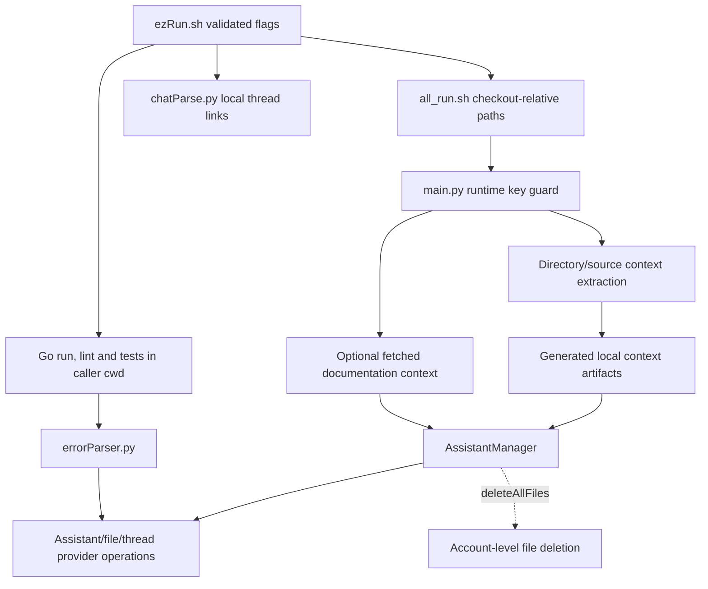

# goPilot source architecture

This is a legacy Python/shell tool around an external Go project, not a Go application or web frontend. [Original documentation](legacy/README-original.md) is preserved as historical context; its old script names are not current entry points.

| Boundary | Source |
| --- | --- |
| Flag forwarding and output paths | [ezRun](../ezRun.sh), [helper wrapper](../goHelpers/all_run.sh) |
| Runtime config and orchestration | [main](../goHelpers/main.py) |
| Context extraction | [getter](../goHelpers/getter.py), [tree](../goHelpers/directoryTree.py), [walker](../goHelpers/walkIt.py) |
| Optional context fetch | [HTML parser](../goHelpers/htmlParser.py) |
| Provider lifecycle | [manager](../goHelpers/addGo.py) |
| Error and link processing | [error parser](../goHelpers/errorParser.py), [chat parser](../goHelpers/chatParse.py) |

## State and side effects

Source consolidation, tree assembly and output parsing write local artifacts. The launchers resolve helper paths from their own location; default outputs live in this checkout's `goHelpers/results`. They validate arguments and the selected context directory before helper work. `-h` and `--help` return without executing helpers or creating results. `-d` selects context and leaves Go commands in the caller's working directory.

The outer launcher stops on helper failure before thread-log cleanup, Go checks or parsers. A failed Go check still sends its diagnostics to the error parser. The error parser reads the report before constructing the manager and supplies its own helper directory for prompt/context paths. The maintained `all_run.sh` is source; Makefile `create_script` and `clean` preserve it.

`AssistantManager` construction fetches/updates the provider assistant. Upload processing may replace provider files and manipulate local copies; error handling may create threads and runs. The delete-all path lists and deletes account-level provider files. These are operations, not inert parsing or a local-only thread reset.

The runtime-key guard requires a nonblank `OPENAI_API_KEY` before Python entry context/provider work. It does not verify identity, account scope, SDK compatibility or remote permissions. Removing a literal from the current source does not remove history or revoke a credential.

## Qualification limits

The repository has no Go module, application routes or browser UI. The standalone HTML helper has a separate version- and hash-pinned dependency set in `requirements-html.txt`; the legacy provider dependency installation remains unpinned. The [CLI guide](developer/cli.mdx#standalone-html-environment) documents isolated HTML installation and its qualification boundary. Offline tests combine selected configuration/startup AST checks with actual context/tree/link helpers, copied launchers running inert executable adapters in temporary checkouts, and the actual error-parser entry with a fake manager. These fixtures establish local parsing, paths, preservation and failure routing. They do not qualify current SDK, provider uploads or external Go integration. Shell syntax and Python AST parsing provide additional syntax checks. Live operations, key/account changes, context uploads and resets require separate qualification.
