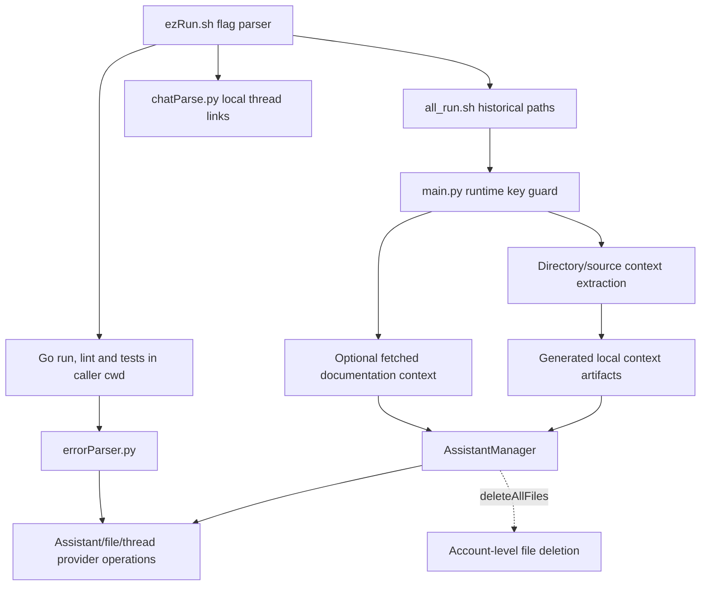

# goPilot source architecture

This is a legacy Python/shell tool around an external Go project, not a Go application or web frontend. [Original documentation](legacy/README-original.md) is preserved as historical context; its old script names are not current entry points.

| Boundary | Source |
| --- | --- |
| Flag forwarding and output paths | [ezRun](../ezRun.sh), [helper wrapper](../goHelpers/all_run.sh) |
| Runtime config and orchestration | [main](../goHelpers/main.py) |
| Context extraction | [getter](../goHelpers/getter.py), [tree](../goHelpers/directoryTree.py), [walker](../goHelpers/walkIt.py) |
| Optional context fetch | [HTML parser](../goHelpers/htmlParser.py) |
| Provider lifecycle | [manager](../goHelpers/addGo.py) |
| Error and link processing | [error parser](../goHelpers/errorParser.py), [chat parser](../goHelpers/chatParse.py) |

## State and side effects

Source consolidation, tree assembly and output parsing write local artifacts. The shell wrapper uses historical helper/output paths that are independent of this checkout's location. `-d` does not change the shell's working directory for Go commands.

`AssistantManager` construction fetches/updates the provider assistant. Upload processing may replace provider files and manipulate local copies; error handling may create threads and runs. The delete-all path lists and deletes account-level provider files. These are operations, not inert parsing or a local-only thread reset.

The runtime-key guard requires a nonblank `OPENAI_API_KEY` before Python entry context/provider work. It does not verify identity, account scope, SDK compatibility or remote permissions. Removing a literal from the current source does not remove history or revoke a credential.

## Qualification limits

No Go module, application routes, browser UI, pinned Python dependency set or original offline test harness was identified. The bounded AST tests validate the new configuration boundary without importing SDK/helpers. Shell syntax and Python AST parsing establish syntax, not provider acceptance. Live operations, key/account changes, context uploads and resets remain outside this review.
