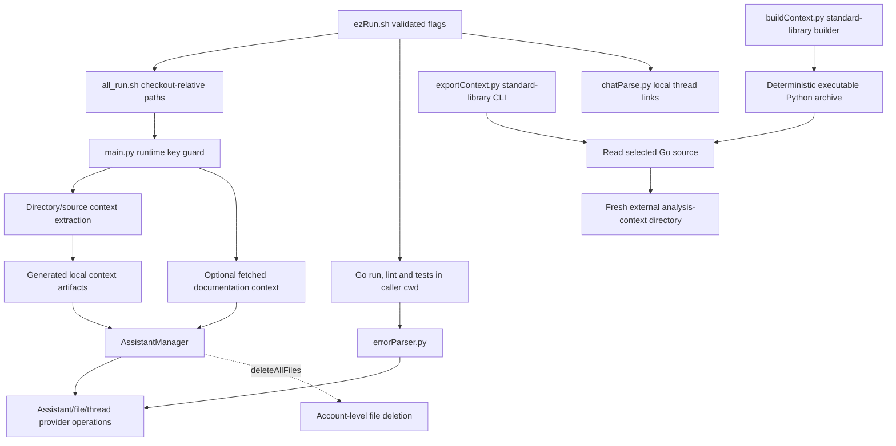

# goPilot source architecture

This is a legacy Python/shell tool around an external Go project, not a Go application or web frontend. [Original documentation](legacy/README-original.md) is preserved as historical context; its old script names are not current entry points. Operating detail lives in the [developer and operation guide](developer/cli.mdx) and the [operations reference](developer/operations-reference.md).

| Boundary | Source |
| --- | --- |
| Flag forwarding and output paths | [ezRun](../ezRun.sh), [helper wrapper](../goHelpers/all_run.sh) |
| Runtime config and orchestration | [main](../goHelpers/main.py) |
| Context extraction | [getter](../goHelpers/getter.py), [tree](../goHelpers/directoryTree.py), [walker](../goHelpers/walkIt.py) |
| Standalone context export | [export CLI](../goHelpers/exportContext.py), [operation contract](developer/cli.mdx#standalone-go-context-export) |
| Standalone executable packaging | [archive builder](../goHelpers/buildContext.py), [installation contract](developer/cli.mdx#standalone-executable-and-local-installation) |
| Optional context fetch | [HTML parser](../goHelpers/htmlParser.py) |
| Provider lifecycle | [manager](../goHelpers/addGo.py) |
| Error and link processing | [error parser](../goHelpers/errorParser.py), [chat parser](../goHelpers/chatParse.py) |

## State and side effects

Source consolidation, tree assembly and output parsing write local artifacts. The provider-aware launchers resolve helper paths from their own location; default outputs live in this checkout's `goHelpers/results`. They validate arguments and the selected context directory before helper work. `-h` and `--help` return without executing helpers or creating results. `-d` selects context and leaves Go commands in the caller's working directory.

The separate `python3 -B goHelpers/exportContext.py SOURCE NEW_OUTPUT_DIR` entry uses only standard-library helpers and performs no provider or Go operations. It requires an existing source and output parent, rejects every existing destination entry including dangling symlinks, and resolves paths to keep output outside the source even through parent symlinks. It exclusively creates a fresh directory with mode 0700 on POSIX. The bundle contains UTF-8 per-package analysis files, the authoritative package map, a source-tree view, a suffix-updated tree view and their combined context. The tree header uses actual discovered packages.

Tree generation first inventories the filtered source hierarchy, then renders it with deterministic directories-first/file ordering, final-sibling branches and ancestor continuation spacing. Directory symlinks are labeled as leaves without following them. Display labels escape backslashes and nonprintable/control characters while retaining readable Unicode. Strict walk errors propagate before the tree destination is opened, preserving any prior tree output. Actual tree producers select the explicit generated-tree suffix-conversion mode; the generic converter's existing metadata behavior remains unchanged. The suffix view preserves source topology without implying per-source output files; the package map remains authoritative for generated package-output identity. Neither traversal inventory nor tree rendering guarantees an atomic source snapshot.

Only complete exports return 0 and print the destination path. Help returns 0 without side effects. Invalid arguments, source read/walk errors, publication or later write failures, and no eligible packages return 1 with a bounded one-line error. A created but incomplete destination is retained and reported rather than replacing existing output or writing generated files into the source. Analysis files are not guaranteed to compile, and exporting provides no atomic source snapshot, source-metadata preservation or crash-durability guarantee; POSIX directory creation establishes no Windows permission claim.

The [export tests](../tests/test_export_context.py) exercise the standard-library CLI against isolated temporary projects, deterministic Unicode package bundles, source/prior-artifact preservation, destination rejection, actual read/publication errors and injected walk/later-write failures. A case-folding collision check is simulated, not a native Windows run. These checks establish no provider acceptance or Windows permission behavior.

The standard-library archive builder embeds exactly the unchanged exporter, getter and tree modules with a bootstrap and source-hash manifest. Fixed archive metadata and ordering provide byte reproducibility from identical source bytes. Manifest hashes identify those bytes rather than signing them. The builder reads and validates sources before publishing a private, fully closed sibling staging file through an exclusive no-overwrite hard link, then removes the owned stage. Errors report actual publication and retained-stage state; a post-publication cleanup error does not imply an absent executable. Source inputs and prior artifacts are not replaced.

The executable's GNU `env -S python3 -I -B -S` shebang selects an isolated, no-site Python runtime. The initial target is Linux CPython 3.10 with compatible GNU `env`; the archive needs that interpreter but no source checkout, virtual environment, dependency installation, provider or Go tool. Candidate user-local installation and artifact hash/mode/executable readback are distinct from source packaging, and neither installation nor readback is established by this architecture description. Crash durability, multiuser-race protection and native-platform/provider acceptance remain separate.

The outer launcher stops on helper failure before thread-log cleanup, Go checks or parsers. A failed Go check still sends its diagnostics to the error parser. The error parser reads the report before constructing the manager and supplies its own helper directory for prompt/context paths. The maintained `all_run.sh` is source; Makefile `create_script` and `clean` preserve it.

`AssistantManager` construction fetches/updates the provider assistant. Upload processing may replace provider files and manipulate local copies; error handling may create threads and runs. The delete-all path lists and deletes account-level provider files. These are operations, not inert parsing or a local-only thread reset.

The runtime-key guard requires a nonblank `OPENAI_API_KEY` before Python entry context/provider work. It does not verify identity, account scope, SDK compatibility or remote permissions. Removing a literal from the current source does not remove history or revoke a credential.

## Qualification limits

The repository has no Go module, application routes or browser UI. The standalone HTML helper has a separate version- and hash-pinned dependency set in `requirements-html.txt`; the legacy provider dependency installation remains unpinned. The [CLI guide](developer/cli.mdx#standalone-html-environment) documents isolated HTML installation and its qualification boundary. Offline tests combine selected configuration/startup AST checks with actual context/tree/link helpers, copied launchers running inert executable adapters in temporary checkouts, and the actual error-parser entry with a fake manager. These fixtures establish local parsing, paths, preservation and failure routing. They do not qualify current SDK, provider uploads or external Go integration. Shell syntax and Python AST parsing provide additional syntax checks. Live operations, key/account changes, context uploads and resets require separate qualification.
