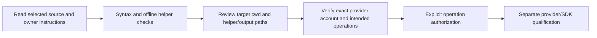

# goPilot developer and operation guide

Inspect [ezRun.sh](../../ezRun.sh) and [all_run.sh](../../goHelpers/all_run.sh) before use. Historical `localtest/run.sh` and `cli_script.sh` names in the [original README](../legacy/README-original.md) do not exist here. Do not run the wrapper merely to obtain a help screen: it has no guaranteed inert dry-run path.

| Source option | Meaning and limitation |
| --- | --- |
| `-d DIRECTORY` | Context directory forwarded to helper; does not change Go command cwd |
| `-u true/false` | Optional context update/fetched context path; not a global no-egress switch |
| `-a true/false` | Provider-account reset path; requires exact account/scope authorization |
| `-r`, `-n`, `-t` with boolean values | External code, lint and test execution; output is routed to provider-aware error handling |
| `-c`, `-l`, `-o` with paths | Code/lint/test output destinations; defaults are historical helper-tree paths |
| Advertised `-x` | Not accepted by current `getopts`; thread-text cleanup defaults true |

All flags off still invoke the helper and its manager. `OPENAI_API_KEY` must come from the runtime environment; the entry guard validates presence only. Never paste a key into source, issue, artifact or canvas. No configuration changes or provider probes are performed by this guide.



For offline local verification from the repository root:

```bash
bash -n ezRun.sh goHelpers/all_run.sh
python3 -B -m unittest discover -s tests -v
```

Tests in [test_runtime_config.py](../../tests/test_runtime_config.py) compile only the selected configuration function and startup-prefix AST, rejecting missing/blank keys and verifying an early error before context/provider work. They never import `main.py`, initialize a provider client or execute the shell wrapper.

The discovery command also runs [test_getter.py](../../tests/test_getter.py) and [test_chat_parse.py](../../tests/test_chat_parse.py). These import the actual offline helpers and execute them against synthetic temporary files, checking generated context, source identity, output paths and input preservation. Selected `main.py` AST blocks are tested separately without importing its provider-aware module. Offline helper execution does not establish assistant/file-upload or external Go integration.

In the shared native WSL workspace, inspect running jobs for this repository, including sibling worktrees, and agree on one verification owner. Run the Python suite through the foreground shared gate rather than the direct command above:

```bash
/home/jkail/.local/bin/agent-heavy-check -- python3 -B -m unittest discover -s tests -v
```

Reuse the owner's result when it covers the selected source. Admission exit 75 means the command did not execute; preserve the log and report contention. Do not repeatedly queue the unchanged command, move it to another harness or worktree, or bypass the gate. A timeout likewise requires diagnosis before another attempt. A documentation-only change can be checked against live source and links without repeating a broad suite.

Python syntax can be checked by `ast.parse` of selected code files without importing them. Avoid `py_compile` if generated cache files would interfere with another owner's checkout. Do not use the helper Makefile as a read-only check: installation and wrapper-generation/clean targets mutate the environment.

External Go checks require a real target module and the shared verification owner/gate. They do not validate assistant lifecycle effects. The legacy SDK calls require a separate current-provider migration/qualification review; this change makes no current compatibility claim.
