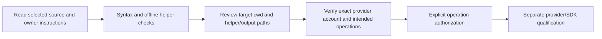

# goPilot developer and operation guide

Inspect [ezRun.sh](../../ezRun.sh) and [all_run.sh](../../goHelpers/all_run.sh) before use. Historical `localtest/run.sh` and `cli_script.sh` names in the [original README](../legacy/README-original.md) do not exist here. Use `bash ezRun.sh --help` or `bash goHelpers/all_run.sh -h` for inert help (exit 0). Help runs no helper, creates no results directory and clears no thread log. Valid operational arguments still invoke the provider-aware helper; there is no offline collection/dry-run mode.

| Source option | Meaning and limitation |
| --- | --- |
| `-d DIRECTORY` | Context directory forwarded to helper; does not change Go command cwd |
| `-u true/false` | Optional context update/fetched context path; not a global no-egress switch |
| `-a true/false` | Provider-account reset path; requires exact account/scope authorization |
| `-r`, `-n`, `-t` with boolean values | External code, lint and test execution; output is routed to provider-aware error handling |
| `-c`, `-l`, `-o` with paths | Code/lint/test outputs; defaults are this checkout's `goHelpers/results/codeRun.txt`, `lintOutput.txt`, `testOutput.txt` |
| `-x true/false` | Clear the local thread log after helper success; default true |
| `-h`, `--help` | Print usage and exit successfully before operational side effects |

Helpers resolve from each launcher's script location, so invoke the checkout from any working directory; quoted context/output paths may contain spaces. `-d` does not change Go command cwd. Every boolean requires exactly `true` or `false`; empty/missing values, unknown options and unexpected positional arguments fail before helper execution or output creation. The context directory must exist and be a directory; this is checked before helper/results work. For paths beginning with `-`, use an explicit relative/absolute path such as `./-name`.

Helper failures propagate their exact exit code through both launchers and stop before thread cleanup, Go checks or postprocessing. Results storage is initialized only after argument validation. After helper success, `-x false` preserves existing thread text without touching the existing log (or initializes an absent log); `-x true` clears it before appending new error links. A Go/lint failure still routes its output to the error parser. Error/thread parser failures return their status; a successful parse does not certify that the Go check passed. The error parser validates/reads the report before manager construction and passes its script-relative helper directory, with a trailing separator, separately from the report path.

All flags off still invoke the helper and its manager. `OPENAI_API_KEY` must come from the runtime environment; the entry guard validates presence only. Never paste a key into source, issue, artifact or canvas. No configuration changes or provider probes are performed by this guide.



For offline local verification from the repository root:

```bash
bash -n ezRun.sh goHelpers/all_run.sh
python3 -B -m unittest discover -s tests -v
```

Tests in [test_runtime_config.py](../../tests/test_runtime_config.py) compile only the selected configuration function and startup-prefix AST, rejecting missing/blank keys and verifying an early error before context/provider work. They never import `main.py`, initialize a provider client or execute the shell wrapper.

The discovery command also runs [test_getter.py](../../tests/test_getter.py) and [test_chat_parse.py](../../tests/test_chat_parse.py). These import the actual offline helpers and execute them against synthetic temporary files, checking generated context, source identity, output paths and input preservation. [Launcher tests](../../tests/test_launchers.py) run copied actual shell scripts with inert executable Python/Go/lint adapters, testing native paths, quoted arguments, caller cwd, validation/help, failure ordering and log preservation. [Error-parser tests](../../tests/test_error_parser.py) run its actual entry with an inert manager module, including missing-report rejection before manager construction. Selected `main.py` AST blocks remain separate and never import its provider-aware module. Offline helper execution does not establish assistant/file-upload or external Go integration. Make preservation tests run only when Make is installed and explicitly skip otherwise.

In the shared native WSL workspace, inspect running jobs for this repository, including sibling worktrees, and agree on one verification owner. Run the Python suite through the foreground shared gate rather than the direct command above:

```bash
/home/jkail/.local/bin/agent-heavy-check -- python3 -B -m unittest discover -s tests -v
```

Reuse the owner's result when it covers the selected source. Admission exit 75 means the command did not execute; preserve the log and report contention. Do not repeatedly queue the unchanged command, move it to another harness or worktree, or bypass the gate. A timeout likewise requires diagnosis before another attempt. A documentation-only change can be checked against live source and links without repeating a broad suite.

Python syntax can be checked by `ast.parse` of selected code files without importing them. Avoid `py_compile` if generated cache files would interfere with another owner's checkout. Do not use the Makefile `install` target as a read-only check: it installs Python dependencies. The maintained launcher is tracked source; `create_script` checks that it exists and `clean` leaves it intact. From the repository root, `make -C goHelpers create_script clean` checks this compatibility boundary without regenerating or deleting the launcher. Tests execute these targets only in temporary copied fixtures; no installation target is run.

External Go checks require a real target module and the shared verification owner/gate. They do not validate assistant lifecycle effects. The legacy SDK calls require a separate current-provider migration/qualification review; this change makes no current compatibility claim.

## Standalone HTML environment

The HTML helper needs Requests and Beautiful Soup, independently of OpenAI, provider keys and Go tools. [requirements-html.in](../../requirements-html.in) records the direct pins; [requirements-html.txt](../../requirements-html.txt) records the complete dependency set with exact versions and SHA-256 hashes. Install the `.txt` file into an isolated `.venv-html`, rather than running the legacy Make install target. The initial qualification target is Linux with CPython 3.10; other environments require separate qualification.

From the repository root, use a Python installation with `venv` and `ensurepip` available:

```bash
python3 -m venv .venv-html
.venv-html/bin/python -m pip install --require-hashes --only-binary=:all: -r requirements-html.txt
.venv-html/bin/python -m pip check
PATH="$PWD/.venv-html/bin:$PATH" bash goHelpers/scrapeWeb.sh 'https://example.org/docs'
```

On GamingRig, the native Python 3.10 lacks the `ensurepip` prerequisite. The installed uv 0.12.10 supports this alternative environment bootstrap; use it instead of the first command, then run the same explicit pip and fetch commands:

```bash
uv venv --python /usr/bin/python3 --no-python-downloads --seed --no-config .venv-html
```

The uv bootstrap can download installer seed packages; their versions are separate from the application dependency pins. [Python venv](https://docs.python.org/3/library/venv.html) and [uv venv](https://docs.astral.sh/uv/reference/cli/#uv-venv) document these environment operations. In the shared WSL workspace, installations and runtime qualification use the existing owner and foreground heavy-check gate.

The quoted PATH selects the environment's `python3` for the shell command, including checkout paths containing spaces. To select the interpreter directly, use `.venv-html/bin/python goHelpers/htmlParser.py 'https://example.org/docs' "$PWD/goHelpers"`. Both commands save context under the chosen helper's `additionalcontext` directory. Recreate the environment at its destination when moving a checkout.

Regenerate the lock with uv 0.12.10 for the same Linux CPython 3.10 target. Run from the repository root with that interpreter available:

```bash
uv pip compile requirements-html.in \
  --python /usr/bin/python3 --python-version 3.10 \
  --python-platform x86_64-unknown-linux-gnu --generate-hashes \
  --only-binary :all: --output-file requirements-html.txt \
  --default-index https://pypi.org/simple --keyring-provider disabled \
  --no-config --no-python-downloads
```

In the shared WSL workspace, dependency resolution also uses the foreground heavy-check gate. Review and commit the complete generated `.txt` file. Installing that committed lock reproduces application versions; resolving after changing the input or tool can select different versions and requires fresh installation and runtime qualification. Keep provider packages outside this standalone dependency set.

Local GamingRig qualification on 2026-10-03 used CPython 3.10.12 and uv 0.12.10. Two fresh environments installed identical application versions from the hash lock, passed `pip check`, and rejected an intentionally corrupted package hash. The bootstrap seed packages were pip 26.2.1, setuptools 84.0.0, wheel 0.48.0 and packaging 26.3. All 69 offline tests passed without skips. Seven real loopback cases covered a full document, repeated URL, body-less fragment, HTTP 404, refused connection, stalled headers and a stalled partial body; failed fetches preserved existing context, and owned server/temporary fixtures were cleaned up. This qualifies the documented Linux environment and local HTTP behavior; it does not qualify provider APIs, external websites or other platforms. A refused connection checks failure routing, not a measured connection-timeout deadline.

HTML web contexts use `web-<ASCII host/path slug up to 80 characters>-<full SHA-256 of the exact URL>_context.txt`. The public HTML helper accepts URLs independently of the fixed eight web resources in `main.py`. Host, scheme, port, query, fragment and percent-encoding spelling contribute to exact URL identity; repeated identical URLs reuse the same filename. The readable slug is only a label. Names stay bounded and contained in the helper's `additionalcontext` directory; request URLs and HTML processing remain unchanged.

Existing legacy context files are retained alongside new names. The assistant helper selects every `*_context.txt` file, so old and new contexts may both be loaded. This change performs no migration or cleanup; review stale files separately before any removal. HTML tests execute the actual helper with inert HTTP and HTML dependency adapters, checking distinct URL outputs, repeated URLs, long/Unicode paths, output containment and legacy-file preservation. They do not qualify live HTTP or BeautifulSoup compatibility.

The standalone HTML command returns status 0 and prints its destination to stdout only after saving a complete context. Fetch, parsing and output failures return status 1 with a single-line diagnostic on stderr; argument errors also return 1. Direct `fetchWebData` callers receive `False` for fetch failures and `True` after saving; processing or filesystem exceptions still propagate to direct callers. The provider-aware multi-URL orchestration has its own error policy.

HTML fetching passes explicit positive timeout values to Requests: 5 seconds for connection establishment and 15 seconds of read inactivity. These limits apply to connections and waits between socket reads; they are not an overall request deadline. DNS resolution, redirects, multiple connection attempts and a response that keeps sending bytes can extend total elapsed time. Timeout failures follow the fetch failure behavior above and preserve existing context files. Focused adapter tests cover the timeout arguments and connection, header-read and body-read failures through the direct helper and Python command. These tests do not qualify live networking or real Requests timeout behavior.

Context output is written as UTF-8 to a private temporary file in the destination directory, closed, then atomically replaced. Failed writes, closes or replacements preserve the previous destination bytes and clean up the owned staging file. Successful output uses private file permissions (0600 on POSIX). Replacement changes the file inode and replaces a destination symlink itself without writing through to its target; existing modes and hard-link sharing are not preserved. This provides atomic file visibility, not power-loss durability. Offline tests cover synthetic failures and actual temporary-file writes; they do not qualify live networking or provider integration.

After installing the standalone HTML environment above, use `PATH="$PWD/.venv-html/bin:$PATH" bash goHelpers/scrapeWeb.sh 'https://example.org/docs'` from this checkout to fetch one URL without invoking the provider-aware manager. The shell command locates the adjacent `htmlParser.py`, forwards the exact quoted URL and helper directory, preserves the caller's working directory and returns the helper's exit status unchanged. It preserves stdout/stderr instead of adding a success fallback. Missing, extra or blank arguments return 1 with usage on stderr; `-h` and `--help` return 0 with usage on stdout before dispatch. Invoke the script in its checkout directory layout; an external symlink must also have the helper beside it. Copied-script tests use inert Python adapters and do not qualify live fetch dependencies or networking.

Body-less HTML fragments are accepted: when no body element exists, formatting uses the parsed fragment tree. Existing body-document index/navigation removal and function formatting are preserved. The fragment regression runs the actual helper entry with an inert HTML adapter. Real HTTP/BeautifulSoup qualification requires a separate local fixture run; the adapter test does not establish external network or provider compatibility.
